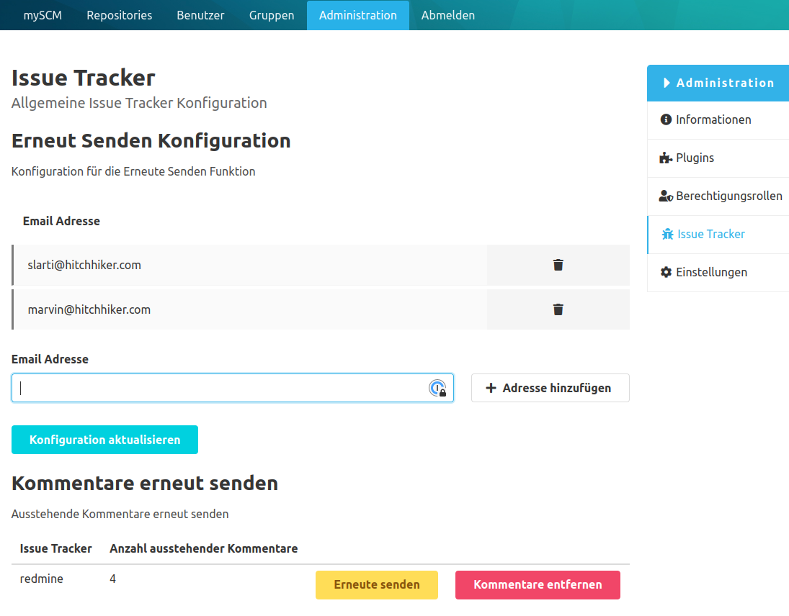

Diese Dokumentation beschreibt die Verwendung vom scm-issuetracker-plugin. Sie steht in verschiedenen Sprachen und Versionen zur Verfügung, die im Menü rechts ausgewählt werden können.

## Funktionen

Das Issue-Tracker Plugin stellt Funkionen bereit, um die Integration von Issue-Trackern in den SCM-Manager zu vereinfachen.
Zu den Funktionen gehören:

* Das Auffinden von Issue Keys in Commit Messages, Markdown Texten, Pull Requests und deren Kommentare
* Das Erstellen von Referenzen in Form von Kommentaren
* Das Ändern des Zustands eines Issues Aufgrund von Schlüsselwörtern
* Erneutes Senden von Kommentaren
* Benachrichtigungen wenn Kommentare nicht hinzugefügt werden konnten

Beispiele für diese Integration sind das [Jira Plugin](/plugins/scm-jira-plugin) und das [Redmine Plugin](/plugins/scm-redmine-plugin).

## Erneutes Senden von Kommentaren

Das Issue-Tracker Plugin speichert automatisch alle Kommentare, die nicht zum Issue-Tracker hinzugefügt werden konnten.

Wenn der Issue-Tracker aufgrund einer Wartung oder eines Fehlers nicht erreichbar war, können die Kommentare über die Admin Oberfläche erneut gesendet werden.

Falls die Kommentare nicht erneut gesendet werden sollen, können sie ebenfalls über die Admin Oberfläche verworfen werden.

In der Oberfläche können auch Kontakte in Form von Email Addressen eintragen werden, die in einem Fehlerfall beanchrichtigt werden sollen.
