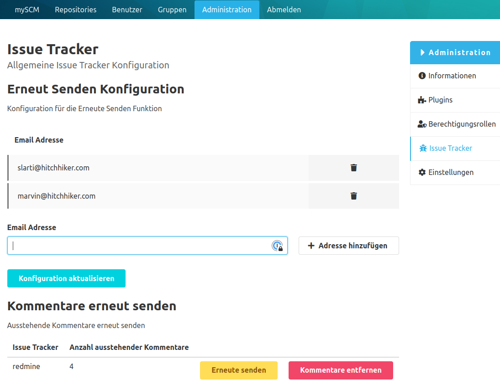

Diese Dokumentation beschreibt die Verwendung vom scm-issuetracker-plugin. Sie steht in verschiedenen Sprachen und Versionen zur Verfügung, die im Menü rechts ausgewählt werden können.

## Funktionen

Das Issue-Tracker-Plugin stellt Funkionen bereit, um die Integration von Issue-Trackern in den SCM-Manager zu vereinfachen.

Zu den Funktionen gehören:

* Das Auffinden von Issue-Schlüsseln in Commitnachrichten, Markdown-Texten und Pull-Requests (inklusive ihren Kommentaren),
* das Erstellen von Referenzen in Form von Kommentaren,
* das Ändern des Zustands eines Issues Aufgrund von Schlüsselwörtern,
* Erneutes Senden von Kommentaren und
* das Bereitstellen von Benachrichtigungen, wenn Kommentare nicht hinzugefügt werden konnten.

Beispiele für diese Integration sind das [Jira-Plugin](/plugins/scm-jira-plugin) und das [Redmine-Plugin](/plugins/scm-redmine-plugin).

## Erneutes Senden von Kommentaren

Das Issue-Tracker-Plugin speichert automatisch alle Kommentare, die nicht zum Issue-Tracker hinzugefügt werden konnten.

Wenn der Issue-Tracker aufgrund einer Wartung oder eines Fehlers nicht erreichbar war, können die Kommentare über die Admin-Oberfläche erneut gesendet werden.

Sollen die Kommentare nicht erneut gesendet werden, können sie ebenfalls über die Admin-Oberfläche verworfen werden.

In der Oberfläche können auch E-Mail-Adressen als Kontakte eintragen werden; diese werden im Falle eines Fehlers benachrichtigt.
