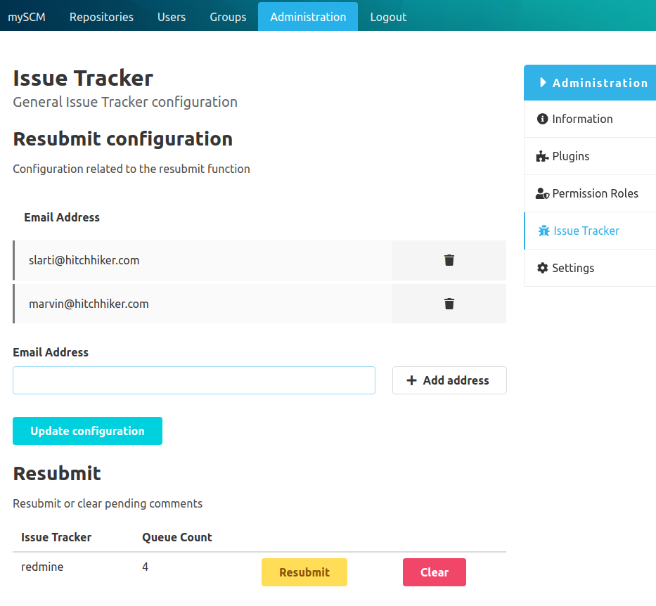

This documentation describes the usage of the scm-issuetracker-plugin. It is available in different languages and versions, which can be selected in the menu on the right.

## Functions

The issue tracker plugin provides functions to simplify the integration of issue trackers into the SCM-Manager.
The functions include:

* Finding issue keys in commit messages, markdown texts, pull requests and their comments
* The creation of references in the form of comments
* Changing the state of an issue based on keywords
* Resubmitting comments
* Send notifications if comments could not be added

Examples of this integration are the [Jira Plugin](/plugins/scm-jira-plugin) and the [Redmine Plugin](/plugins/scm-redmine-plugin).

## Resubmit comments

The issue tracker plugin automatically saves all comments that could not be added to the issue tracker.

If the issue tracker was unavailable due to maintenance or an error, the comments can be resent via the admin interface.

If the comments should not be resent, they can also be cleared via the admin interface.

In the interface you can also enter contacts in form of email addresses that should be notified in case of an error.
